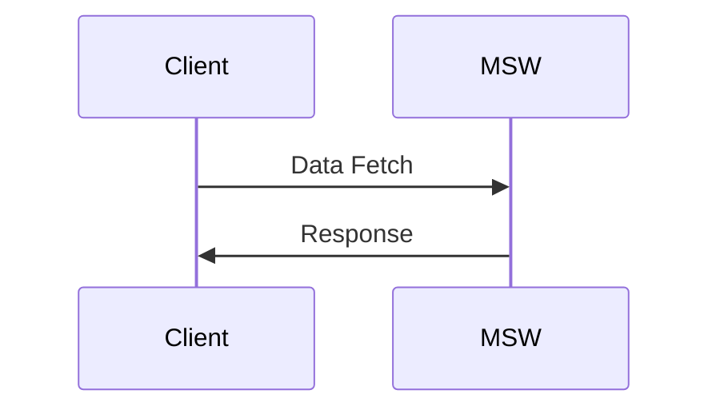

# @hrgui/imaginary-pet-shop

This ia sample test e-commerce pet shop. You can only buy cats or dogs. Once you refresh the page, the cats and dogs you bought are no longer available.

# Getting Started

## Installation

```
yarn
```

## Development

```
yarn dev
```

# Assumptions

This focuses on the browsing UI/API, not the checkout UI/API. The checkout feature assumes:

1. You have unlimited money and can always checkout.

# Data Flow



# API

## /api/search/animal_type

Fetches all possible animal types.

## /api/animal/:id

Fetches one animal.

## /api/checkout

Checks out the user.

## /api/cart

Adds the item to the cart.

# Tech Stack

- [React](https://reactjs.org/) for react componnets.
- [Vite](https://vitejs.dev/) for the development environment
- [Vitest](https://vitest.dev/) for the test environment
- [React Query](https://tanstack.com/query/v4/?from=reactQueryV3&original=https://react-query-v3.tanstack.com/) for fetching data
- [MSW](https://mswjs.io/) for a mock API

# Notes

- fireEvent only works with jsdom, not happy-dom
