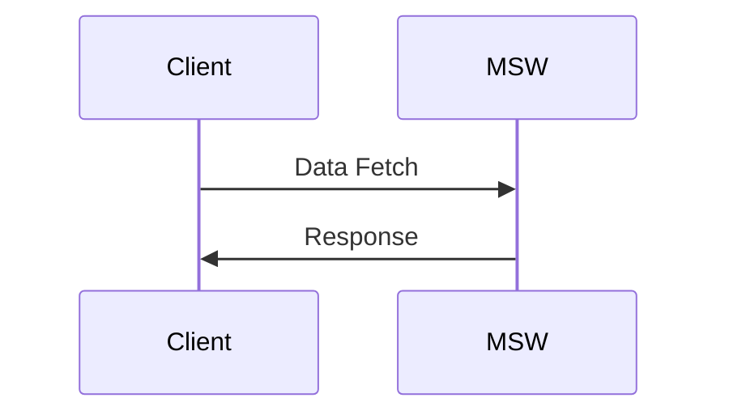

# @hrgui/imaginary-pet-shop

This ia sample test e-commerce pet shop. You can only buy cats or dogs. Once you refresh the page, the cats and dogs you bought are no longer available.

# Getting Started

## Installation

```
yarn
```

## Development

```
yarn dev
```

# Assumptions

This focuses on the browsing UI/API, not the checkout UI/API. The checkout feature assumes:

1. You have unlimited money and can always checkout.

# Data Flow



# API

See [`./src/types.d.ts`](./src/types.d.ts) for more info.

## /api/search/:type

Does a search for animals or animal types.

### Input

#### InputParams

```ts
interface AnimalSearchParams {
  type: "animal_type" | "animal";
}
```

#### SearchParams

```ts
interface PetFilters {
  name?: string;
  type_id?: string | null;
  min_price: number;
  max_price: number;
}
```

### Output

```ts
type Output = Animal[];
```

## /api/animal/:id

Fetches one animal.

### Output

#### 404 Error

No content

#### 200 Success

```ts
type Output = Animal[];
```

## /api/checkout

- Checks out the user, takes out the items from the cart from inventory.
- Adds the item to their collection

### Output

#### 200 Success

```ts
type Output = Animal[];
```

## /api/cart

Adds the item to the cart.

### Output

#### 200 Success

```ts
type Output = Animal[];
```

## /collection

Obtains their collection. Can return nothing back.

### Output

#### 200 Success

```ts
type Output = Animal[];
```

# Tech Stack

- [React](https://reactjs.org/) for react components.
- [TailwindCSS](https://tailwindcss.com/) for CSS
- [Vite](https://vitejs.dev/) for the development environment
- [Vitest](https://vitest.dev/) for the test environment
- [React Query](https://tanstack.com/query/v4/?from=reactQueryV3&original=https://react-query-v3.tanstack.com/) for fetching data
- [MSW](https://mswjs.io/) for a mock API

# Notes

- fireEvent only works with jsdom, not happy-dom
